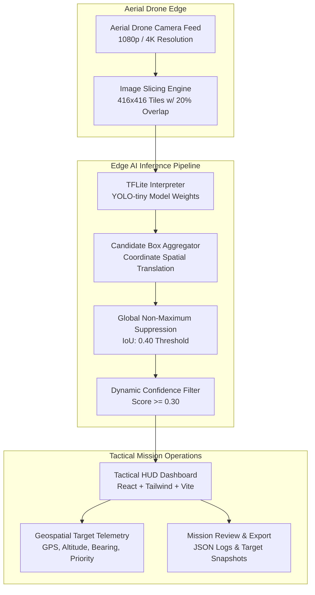

# RescueLens: Edge AI Aerial Detection System

[](https://react.dev/)
[](https://www.typescriptlang.org/)
[](https://vitejs.dev/)
[](https://tailwindcss.com/)
[](https://fastapi.tiangolo.com/)
[](https://www.python.org/)
[](https://www.tensorflow.org/lite)
[](https://github.com/ultralytics)
[](https://www.docker.com/)
[](LICENSE)

**RescueLens** is a tactical, on-device Edge AI aerial reconnaissance and computer vision system engineered for search-and-rescue (SAR), disaster response, and maritime/wilderness emergency operations. 

It executes lightweight **YOLO Tiny** inference via **TensorFlow Lite (`tf.lite.Interpreter`)**, pairing high-resolution spatial image tiling (slicing) with global Non-Maximum Suppression (NMS) to detect small, distant human targets captured from aerial drone altitudes (45m–85m) with sub-second latency and zero mandatory cloud connectivity.

---

## System Architecture



### Key Technical Pillars

1. **High-Resolution Overlapping Tiling (Slicing):** Standard deep learning models downsample 4K drone frames to $416\times 416$ or $640\times 640$, obliterating tiny human targets (often only $10\times 15$ pixels in aerial views). RescueLens partitions full-resolution frames into overlapping $416\times 416$ tiles with a **20% overlap stride**, ensuring targets crossing tile boundaries are completely preserved.
2. **On-Device Edge Inference:** Strictly on-device inference using quantized/optimized TensorFlow Lite weights (`yolo_tiny_rescue.tflite`). Does not transmit sensitive reconnaissance footage over commercial networks or depend on cloud connectivity.
3. **Global Non-Maximum Suppression (NMS):** Deduplicates detections from overlapping stride boundaries into unified global coordinates across the source image.
4. **Authentic Aerial Mission Pack:** Bundled with 20 real-world high-resolution drone mission frames from the **VisDrone** aerial dataset, featuring realistic flight telemetry (GPS coordinates, altitude, heading, timestamps).

---

## Tactical Dashboard Overview

```
+-----------------------------------------------------------------------------------------+
| [RESCUELENS HUD]  ALT: 64.2m | HDG: 142° SE | GPS: 39.9042°N, 116.4074°E | STATUS: ONLINE|
+-----------------------------------------------------------------------------------------+
|                                           | [TARGET TELEMETRY]                          |
|   +-----------------------------------+   | Total Targets: 3                            |
|   |         [AERIAL VIEWPORT]         |   | Primary Priority: CRITICAL                  |
|   |                                   |   | Inference Time: 42.1ms                      |
|   |     +--------+                    |   +---------------------------------------------+
|   |     | Target | 94.2% conf         |   | [DETECTION ROSTER]                          |
|   |     | HUMAN  |                    |   | #01: HUMAN (94.2%) [LAT 39.9044, LON 116.40]|
|   |     +--------+                    |   | #02: HUMAN (88.7%) [LAT 39.9041, LON 116.40]|
|   |                                   |   | #03: HUMAN (81.5%) [LAT 39.9039, LON 116.41]|
|   |                                   |   +---------------------------------------------+
|   +-----------------------------------+   | [ACTIONS]                                   |
|   [◀ PREV]  FRAME 04 / 20  [NEXT ▶]      | [BATCH PROCESS MISSION]  [EXPORT MISSION]   |
+-----------------------------------------------------------------------------------------+
```

---

## Quickstart with Docker (Production Deployment)

The fastest and most reliable way to run the complete RescueLens edge detection stack is using Docker Compose.

### 1. Prerequisites
- [Docker](https://docs.docker.com/get-docker/) (v24.0+)
- [Docker Compose](https://docs.docker.com/compose/install/) (v2.20+)

### 2. Launch Services
From the project root:

```bash
docker compose up --build
```

### 3. Access Services
- **Tactical Mission Web Dashboard:** [http://localhost:3000](http://localhost:3000)
- **FastAPI Edge Detection Engine:** [http://localhost:8000](http://localhost:8000)
- **Interactive OpenAPI / Swagger Documentation:** [http://localhost:8000/docs](http://localhost:8000/docs)
- **Health Check Endpoint:** [http://localhost:8000/health](http://localhost:8000/health)

### 4. Stop Services
```bash
docker compose down
```

---

## Local Development Setup

If you wish to develop without Docker containers:

### Backend Setup

```bash
cd backend

# Option A: Using uv (Recommended)
uv sync
uv run uvicorn backend.main:app --app-dir src --host 0.0.0.0 --port 8000 --reload

# Option B: Standard Python venv
python3.11 -m venv .venv
source .venv/bin/activate
pip install -r requirements.txt
uvicorn backend.main:app --app-dir src --host 0.0.0.0 --port 8000 --reload
```

### Frontend Setup

```bash
cd frontend

# Install Node dependencies
npm install

# Run Vite development server (with HMR)
npm run dev
```

The frontend will be available at [http://localhost:5173](http://localhost:5173) and will proxy API calls to the local FastAPI backend.

---

## API Reference

### 1. System Health Check

Verifies backend runtime health, model allocation status, and configuration.

- **URL:** `/health`
- **Method:** `GET`
- **Response `200 OK`:**

```json
{
  "status": "online",
  "engine_ready": true,
  "is_demo": false,
  "execution_adapter": "TFLite On-Device Production",
  "model_path": "/app/yolo_tiny_rescue.tflite",
  "confidence_threshold": 0.45
}
```

---

### 2. Single Aerial Image Detection

Accepts a single high-resolution drone image, generates overlapping $416\times 416$ spatial tiles, executes TFLite inference per tile, applies global NMS, and returns detected human targets.

- **URL:** `/api/detect`
- **Method:** `POST`
- **Content-Type:** `multipart/form-data`
- **Query Parameters:**
  - `confidence_threshold` *(optional, float, default: `0.45`)*: Minimum confidence threshold.

**Example `curl` Request:**

```bash
curl -X POST "http://localhost:8000/api/detect?confidence_threshold=0.45" \
  -H "Accept: application/json" \
  -F "file=@/path/to/drone_aerial_frame.jpg"
```

**Response `200 OK`:**

```json
{
  "count": 2,
  "detections": [
    {
      "label": "human",
      "class": "human",
      "confidence": 0.924,
      "box": [452.1, 810.4, 498.6, 902.0],
      "bbox": [452.1, 810.4, 498.6, 902.0]
    },
    {
      "label": "human",
      "class": "human",
      "confidence": 0.841,
      "box": [1120.0, 340.5, 1158.2, 412.3],
      "bbox": [1120.0, 340.5, 1158.2, 412.3]
    }
  ],
  "inference_time_ms": 38.64,
  "is_demo": false,
  "execution_adapter": "TFLite On-Device Production",
  "model_architecture": "YOLO-tiny (On-Device TFLite)",
  "runtime": "TensorFlow Lite"
}
```

---

### 3. Batch Mission Processing

Accepts a batch of up to 100 drone aerial images, processing each through the on-device tiled YOLO pipeline and returning aggregated mission detections with overall timing statistics.

- **URL:** `/api/batch-process`
- **Method:** `POST`
- **Content-Type:** `multipart/form-data`
- **Query Parameters:**
  - `confidence_threshold` *(optional, float, default: `0.45`)*: Minimum confidence cutoff.

**Example `curl` Request:**

```bash
curl -X POST "http://localhost:8000/api/batch-process" \
  -H "Accept: application/json" \
  -F "files=@frame_001.jpg" \
  -F "files=@frame_002.jpg" \
  -F "files=@frame_003.jpg"
```

**Response `200 OK`:**

```json
{
  "count": 7,
  "detections": [ ... ],
  "inference_time_ms": 114.28,
  "is_demo": false,
  "execution_adapter": "TFLite On-Device Production",
  "model_architecture": "YOLO-tiny (On-Device TFLite)",
  "runtime": "TensorFlow Lite"
}
```

---

### Error Responses & Contracts

| HTTP Status | Condition | Example Response |
|:------------|:----------|:-----------------|
| `400 Bad Request` | Uploaded image is empty, invalid format, or batch size > 100 images. | `{"detail": "The uploaded image file is empty."}` |
| `413 Payload Too Large` | Batch payload exceeds Nginx/reverse proxy max body size (configured at 150MB). | `413 Request Entity Too Large` |
| `503 Service Unavailable` | Inference engine is initializing or model file could not be loaded. | `{"detail": "Inference engine is not initialized."}` |
| `500 Internal Server Error`| Internal image decoding or inference tensor failure. | `{"detail": "Inference failure: <trace>"}` |

---

## Environment Variables

| Variable | Target | Default | Description |
|:---------|:-------|:--------|:------------|
| `MODEL_PATH` | Backend | `yolo_tiny_rescue.tflite` | Path to the compiled TFLite model weights. |
| `CONFIDENCE_THRESHOLD` | Backend | `0.45` | Default detection confidence threshold for human targets. |
| `RAW_CONF_THRESHOLD` | Backend | `0.45` | Raw candidate cutoff prior to global Non-Maximum Suppression. |
| `ALLOWED_ORIGINS` | Backend | `http://localhost:3000,...` | Comma-separated list of allowed CORS origins or `*`. |
| `ENVIRONMENT` | Backend | `production` | Environment mode (`development` / `production`). |
| `VITE_API_BASE_URL` | Frontend | `""` (in Docker) / `http://127.0.0.1:8000` (dev) | Target backend origin. Empty string uses relative Nginx proxy routes. |

---

## Directory Structure

```
RescueLens/
├── docker-compose.yml              # Multi-container orchestration (Frontend + Backend)
├── backend/
│   ├── Dockerfile                  # Python 3.11-slim production container
│   ├── requirements.txt            # Python dependencies (FastAPI, TFLite, OpenCV)
│   ├── .dockerignore               # Docker build exclusions
│   ├── yolo_tiny_rescue.tflite     # Quantized on-device YOLO Tiny model
│   ├── pyproject.toml              # UV / PEP 621 package metadata
│   └── src/
│       └── backend/
│           ├── __init__.py
│           └── main.py             # FastAPI endpoints, tiling, TFLite inference & NMS
├── frontend/
│   ├── Dockerfile                  # Multi-stage build (Node 20 -> Nginx Alpine)
│   ├── nginx.conf                  # Custom Nginx SPA routing & API reverse proxy
│   ├── .dockerignore               # Docker build exclusions
│   ├── package.json                # React 19, Vite 6, Tailwind CSS 4
│   ├── public/
│   │   └── mission-pack/           # 20 Authentic VisDrone high-resolution aerial frames
│   └── src/
│       ├── components/             # Tactical Mission Dashboard, Viewport & HUD
│       ├── services/inference/     # TFLite inference client & image preprocessor
│       ├── state/                  # MissionContext, telemetry & flight feed
│       └── types/                  # TypeScript interfaces & coordinate specs
└── model/
    ├── train.py                    # Ultralytics training pipeline for aerial datasets
    ├── export_tflite.py            # FP16/INT8 TFLite export script
    └── convert_visdrone.py         # VisDrone to YOLO format conversion
```

---

## Verification and Testing

To verify both frontend and backend pipelines locally:

```bash
# Test frontend compilation and TypeScript type checking
cd frontend
npm run build
npx tsc --noEmit

# Test backend imports and TFLite model resolution
cd ../backend
uv run python -c "import backend.main; print('Backend loaded successfully!')"
```

---

## License

This project is licensed under the [MIT License](LICENSE).
